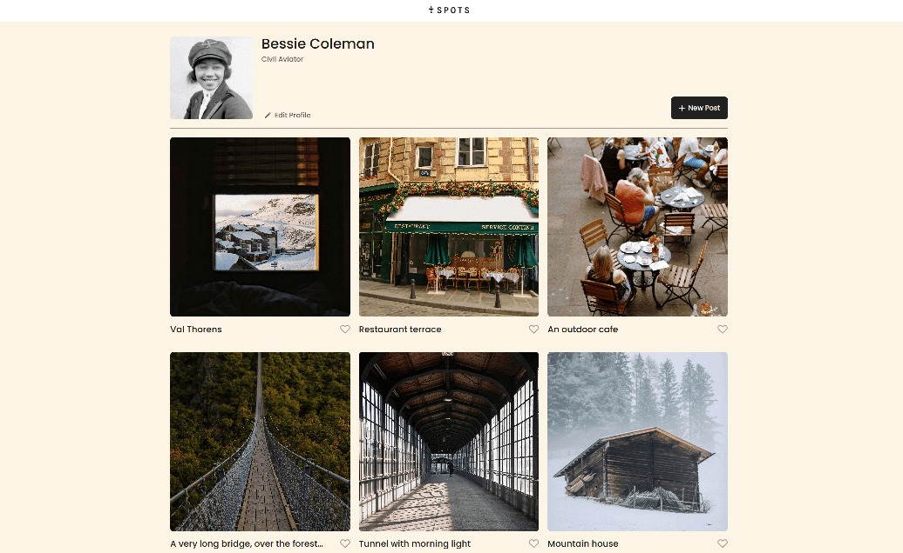
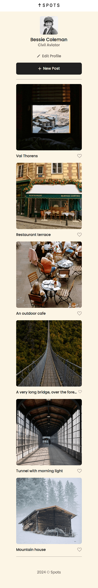

# Project 3: Spots

## Overview

- Intro
- Description
- Tech Stack
- Figma
- Images

## Intro

An image sharing site

## Description

Spots is an image sharing site that is browsable on all devices. Users create profiles and upload images that can be viewed by anyone. Using responsive web design techniques, this site looks just as great on mobile phones & tablets as it does on desktop computers and laptops.

## Tech Stack

- HTML
- CSS
- Responsive Design
- Figma

## Images

## Video

[Devlog](https://drive.google.com/file/d/1K_pR6Lv4-rHMKcfhodW4fNY4THPpautb/view?usp=sharing "Devlog")

## Link

[Spots Website](https://julesdowork.github.io/se_project_spots/ "Spots Website")
